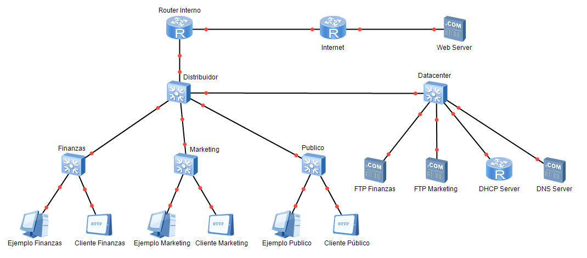
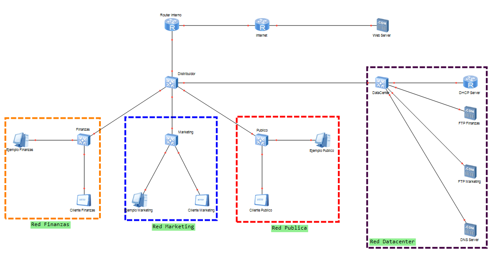

# Trabajo Practico Integrador de Redes De Comunicacion 2019
En este repositorio voy a poner todo lo que pensé/desarrollé para realizar este trabajo práctico. A medida que lo hago explico varios conceptos para poder entender bien como realizo el trabajo.
## Introduccion
Dada la siguiente infraestructura de red:

Realizar todas las configuraciones necesarias para cumplir con los siguientes requisitos:
 1. Considerar que el tamaño de las redes es el siguiente:
 - **Público**: 200 hosts
 - **Finanzas**: 50 hosts
 - **Marketing**: 50 hosts
 
	Y luego asignar subredes de forma tal que *no exista comunicación directa entre las diferentes áreas*, sino sólo a través del **"Router Interno"**, utilizando el segmento **172.18.4.0/23**

2. Todas las áreas deben obtener su configuración de forma **automática** utilizando el **DHCP Server**

3. Cáda área con **servidor FTP** debe tener acceso exclusivo al mismo.

4. Todas las áreas deben poder resolver nombres utilizando **DNS**

5. Sólo el área pública tiene acceso a internet

6. En el caso de ser necesario realizar configuraciones de routeo, las mismas deben ser dinámicas utilizando **RIP**.

7. Asignar nombres de DNS a los servidores **FTP** y **HTTP**.

> Por limitaciones del simulador, es necesario que existan clientes que no son PC para realizar pruebas FTP y HTTP, y los mismos no pueden ser configurados automáticamente por DHCP, por lo tanto, asignar IP estática, y removerla del pool de direcciones DHCP.
> 
> Pueden utilizarse todas las herramientas adicionales necesarias que no
> estén descriptas en las restricciones, como por ejemplo **Vlans**.

## Desarrollo
Dado el segmento de red que nos dieron, vamos a primero ver como se van distribuir las IP dentro del sistema.
Primero, vamos a segmentar (de forma abstracta) a la red:

|VLAN ID|Nombre de VLAN|Descripción|
|--|--|--|
|VLAN 10|publicVlan|-|
|VLAN 20|financeVlan|-|
|VLAN 30|marketingVlan|-|

|Nombre de Red|Segmento de red asignado|Mascara de red|Bloque de direcciones utilizables|Nombre de VLAN|
|--|--|--|--|--|
|Red Publica|172.18.4.0/24|255.255.255.000|172.18.4.1-172.18.4.254|publicVlan|
|Red Finanzas|172.18.5.0/26|255.255.255.192|172.18.5.1-172.18.4.62|financeVlan|
|Red Marketing|172.18.5.64/26|255.255.255.192|172.18.5.65-172.18.4.126|marketingVlan|
|Router Interno - Internet|172.18.5.128/30|255.255.255.252|172.18.5.129-172.18.4.130|-|
|Router Interno - Servidor DNS|172.18.5.132/30|255.255.255.252|172.18.5.133-172.18.4.134|DNSVlan|

Van a ver direcciones IP que van a ser "especiales", es decir, van a ser asignadas a ciertos servidores (como por ejemplo, el servidor DHCP). Estan van a ser asiganadas de la siguiente manera:

|Denominación|Direccion IP asignada|
|--|--|
|Servidor DHCP Público|172.18.4.1|
|Servidor DHCP Finanzas|172.18.5.1|
|Servidor DHCP Marketing|172.18.5.65|
|Servidor FTP Finanzas|172.18.5.2|
|Servidor FTP Marketing|172.18.5.66|

Por limites del simulador, asignamos a los sistemas "clientes" las sigueintes direcciones:

|Denominación|Direccion IP asignada|
|--|--|
|Cliente Finanazas|172.18.4.2|
|Cliente Marketing|172.18.5.2|
|Cliente Publico|172.18.5.66|

Como tenemos un solo router que actua como servidor DHCP, vamos a hacer una partición lógica del puerto del router que va hacia el switch del DataCenter. De esta manera, podremos asignar a los sistemas que esten en cada VLAN diferentes direcciones IP de diferentes pools de direcciones.

Para la configuración seguiremos los siguientes pasos:

1. [x] Asignar direcciones IP sin DHCP a todos los dispositivos
2. [x] Configurar las VLAN en cada Switch (por asi decirlo,'configuramos la capa 2')
